# PLAMIO mini

> **AI-Friendly Game / UI Framework for Arduino IDE**

A lightweight game framework designed for AI-assisted game development.

------------------------------------------------------------------------

# Features

`PLAMIO mini` is a streamlined version of [PLAMIO](https://github.com/mshujp/PLAMIO/) adapted for the Arduino IDE.
For the full feature set, use PLAMIO instead.

-   Supports the creation of a single game.
-   AI-friendly public API
-   Portable game code across supported Arduino.
-   Unified Graphics / Input / Audio / Storage APIs
-   Supports both game UIs and Arduino-based sensor monitoring or data logging applications.
-   Fixed 30 FPS game loop
-   Built-in SaveData helper
-   2D viewport and scrolling support
-   PWM / I2S audio support
-   SSD1306 / ILI9341 display support
-   AI-oriented documentation and API design

- **Supported platforms**
  - Raspberry Pi Pico family (RP2040 / RP2350)
  - ESP32
  

| Hardware |  |
| :---: | :---: |
| 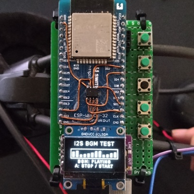 | 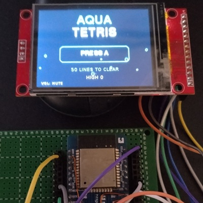 |
| 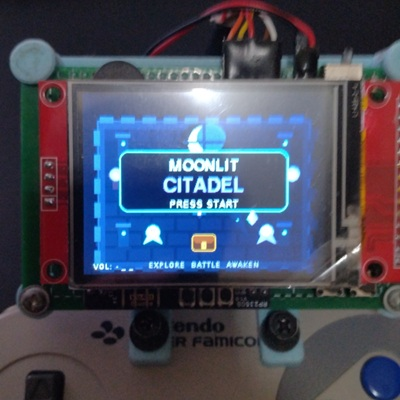 | 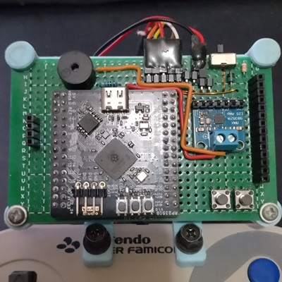 |

| ScreenShots | |
| :---: | :---: |
| 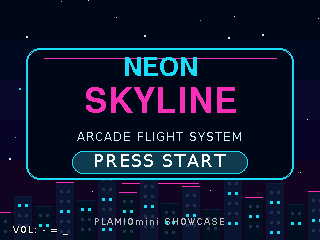 | 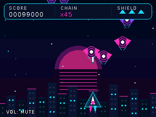 |
| 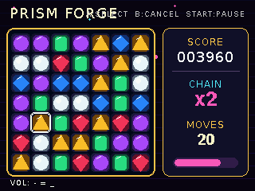 | 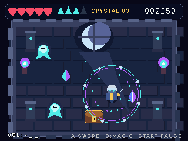 |
| 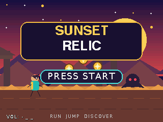 | 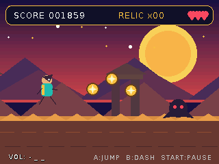 |
| 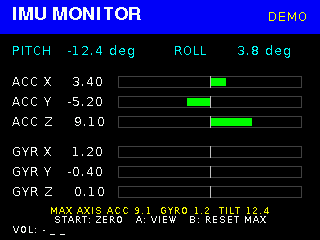 | 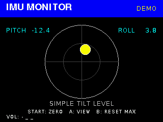 |
| 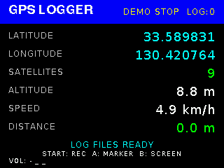 | |

------------------------------------------------------------------------

# Philosophy

PLAMIO is designed so that both humans and AI can write games using the same simple API.

Games implement only a small set of interfaces while the runtime manages graphics, input, audio, storage, and the game loop.

This allows game logic to remain clean, portable, and easy to generate.

------------------------------------------------------------------------

# Build Requirements

## Required tools

-   Arduino IDE

------------------------------------------------------------------------

# Install

Download this project as a ZIP file, then install it from the Arduino IDE menu:
`Sketch` → `Include Library` → `Add .ZIP Library...`

------------------------------------------------------------------------

# Creating a Game

To create a game, simply create **one class** that inherits from the `PLAMIOmini::GameMini` class.

The PLAMIO system automatically manages the game loop, rendering, input, audio, and storage.

Your game only needs to implement its own game logic.

## Core API

PLAMIO provides the following hardware abstraction interfaces to every game.

Game code does not need to access platform-specific hardware or drivers directly.

| Class | Purpose |
|------|---------|
| `PLAMIOmini::Graphics` | Drawing API for text, shapes, images, and sprites. |
| `PLAMIOmini::Input` | Controller input, button state, repeat, and hold detection. |
| `PLAMIOmini::Audio` | Play sound effects and music. |
| `PLAMIOmini::Storage` | Read and write save data and configuration files. |

For the complete API reference, see:

- [`src/PLAMIOmini.h`](src/PLAMIOmini.h)

## Hardware Configuration

see the example [00B_Hardware_Setup](examples/00B_Hardware_Setup/00B_Hardware_Setup.ino)

## `PLAMIOmini::GameMini` class

Your game class should inherit from the `PLAMIOmini::GameMini` class.

Most games implement their game logic in:

- `onInit()`
- `onUpdate()`
- `onDraw()`
- `onTerminate()`

For the complete `PLAMIOmini::GameMini` class reference, see:

- [`src/PLAMIOmini.h`](src/PLAMIOmini.h)

## AI Workflow

PLAMIO is designed for AI-assisted game development.

see the example [00A_AI_Game_Generation](examples/00A_AI_Game_Generation/00A_AI_Game_Generation.ino)

------------------------------------------------------------------------

# Samples

| Sample | Description |
|--------|-------------|
| [00A_AI_Game_Generation](examples/00A_AI_Game_Generation/00A_AI_Game_Generation.ino) | AI-assisted game generation workflow |
| [00B_Hardware_Setup](examples/00B_Hardware_Setup/00B_Hardware_Setup.ino) | Hardware configuration reference |
| [01_Hello_PLAMIO](examples/01_Hello_PLAMIO/01_Hello_PLAMIO.ino) | Minimal PLAMIOmini game |
| [01_Hello_PLAMIO_SSD1306](examples/01_Hello_PLAMIO_SSD1306/01_Hello_PLAMIO_SSD1306.ino) | Minimal PLAMIOmini game |
| [02_Input_Basics](examples/02_Input_Basics/02_Input_Basics.ino) | Button input and movement |
| [03_Graphics_Basics](examples/03_Graphics_Basics/03_Graphics_Basics.ino) | Shapes, colors, fonts, and alignment |
| [04_Audio_Basics](examples/04_Audio_Basics/04_Audio_Basics.ino) | Sound effects and music |
| [05_Save_Data](examples/05_Save_Data/05_Save_Data.ino) | SaveData loading and saving |
| [06_Collision](examples/06_Collision/06_Collision.ino) | Collision detection APIs |
| [07_Animation](examples/07_Animation/07_Animation.ino) | Time-based animation and Tween |
| [08_Breakout](examples/08_Breakout/08_Breakout.ino) | Complete action game |
| [09_Star_Dodge](examples/09_Star_Dodge/09_Star_Dodge.ino) | Avoidance game with effects |
| [10_Reversi](examples/10_Reversi/10_Reversi.ino) | Board game and CPU logic |
| [11_Memory_Tiles](examples/11_Memory_Tiles/11_Memory_Tiles.ino) | Memory game with state transitions |
| [12_IMU_Monitor](examples/12_IMU_Monitor/12_IMU_Monitor.ino) | IMU sensor monitoring and simple tilt visualization |
| [13_GPS_Logger](examples/13_GPS_Logger/13_GPS_Logger.ino) | GPS monitoring and CSV data logging to an SD card |

Each sample is placed under the [`examples`](examples) directory.

## Learning Path

The examples are intended to be completed in numerical order.
Each example introduces one or more new concepts while building on previous examples.

------------------------------------------------------------------------

## Recommended AI

PLAMIO is designed to work with modern AI coding assistants.

Based on current development experience:

| AI | Recommendation | Notes |
|----|---------------|-------|
| **ChatGPT** | **Highly Recommended** | Best overall experience with PLAMIO |
| **Claude** | **Recommended** | Strong at understanding the SDK and generating well-structured game code |
| **Gemini** | **Not Recommended** | Gemini struggles with interpreting the contents of the ZIP file. |
| **Copilot** | **Not Recommended** | Does not currently support zip file uploads, making it difficult to provide the PLAMIO SDK. |
| **Google Search AI Mode** | **Not Recommended** | Does not currently support file uploads, making it difficult to provide the PLAMIO SDK. |

------------------------------------------------------------------------

# Hardware Notes

## Minimum Configuration

- **Main board:** RP2040  
  Examples: Waveshare RP2040 Zero
- **Input:** About 6 tactile switches  
  D-pad, A, and B 
- **Display:** SSD1306
- **Audio:** PWM  
  Add a potentiometer for volume adjustment if needed.
- **Storage:** Emulated EEPROM  
  Uses the board's built-in flash storage.

## Standard Configuration

- **Main board:** RP2350 or ESP32  
  Examples: Raspberry Pi Pico 2 or ESP32
- **Input:** About 7 tactile switches  
  D-pad, A, B, and Start
- **Display:** ILI9341
- **Audio:** I2S
- **Storage:** SD card reader

## Pin Assignment Advice

Ask an AI assistant to read this page, then describe your hardware configuration and request advice on suitable pin assignments.

## GPIO BUTTONS

Internal pull-up resistors are used.

## SD Card SPI

For SD card builds, the following configuration is recommended and has been verified on both RP2040 and RP2350.

| Peripheral | SPI |
|------------|-----|
| ILI9341 LCD | SPI1 |
| SD Card | SPI0 |

This configuration has been verified on both RP2040 and RP2350 and is recommended for best compatibility.

### SD Card

Use an SDHC or SDXC card with a capacity of 4 GB or more.

Although the Arduino-based PLAMIOmini implementation may work with some 2 GB standard SD cards,
they are not officially supported. This keeps SD card requirements consistent with the full PLAMIO framework.

> [!WARNING]
> Although PLAMIO provides a software shutdown option, embedded systems can still lose power unexpectedly (for example, due to battery removal or depletion).
> Do **not** store important or irreplaceable data on the SD card.

## PWM Audio

Use a passive buzzer or an appropriate transistor/amplifier circuit.
Do not connect a low-impedance speaker directly to a GPIO pin.

PWM audio supports only **MUTE** or **ON**.
If adjustable volume is required, use an external amplifier or a potentiometer.

## I2S

For RP2040 and RP2350, PLAMIOmini uses the I2S library included with the Earle Philhower Arduino-Pico core. LRCLK/WS must use the GPIO immediately following BCLK.

------------------------------------------------------------------------

## PLAMIOmini Hardware Compatibility

| Platform | ILI9341 | SSD1306 | PWM | I2S | GPIO | SNES Pad | Emulated EEPROM | SD |
|---|:---:|:---:|:---:|:---:|:---:|:---:|:---:|:---:|
| RP2040 | ✅ | ✅ | ✅ |  | ✅ |  | ✅ | ✅ |
| RP2350 | ✅ |  |  | ✅ |  | ✅ | ✅ *1 | ✅ |
| ESP32 | ✅ | ✅ | ✅ | ✅ | ✅ |  | ✅ | ✅ |
| ESP32-S3 |  |  |  |  |  |  |  |  |
| ESP32-C3/C6 |  |  |  |  |  |  |  |  |

- ✅: Verified on actual hardware
- Blank: Not yet tested. A blank cell does **not** mean unsupported or incompatible.
  Some untested combinations may already be supported by the implementation, but they have not yet been verified on physical hardware.

*1: When emulated EEPROM is written while I2S audio is playing on RP2350, audible noise may occur. Using I2S and emulated EEPROM together is therefore not recommended.

Hardware test reports are welcome, especially for currently unverified boards such as ESP32-S3, ESP32-C3, and ESP32-C6.
------------------------------------------------------------------------

# License

MIT License

## Third party License

This project includes a minimized subset of LovyanGFX 1.2.26.

Only the components required by PLAMIOmini are included.
Unused panels, buses, touch drivers, platform implementations, and font data have been removed.

The original copyright notices and applicable license files for all retained components are preserved.
